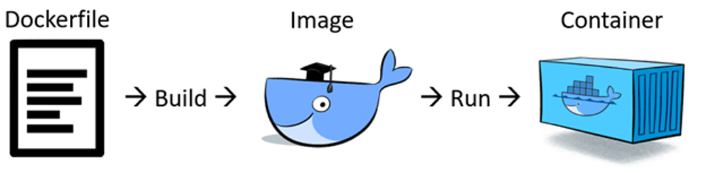

# Tài liệu hướng dẫn sử dụng Docker
 
Đây là tài liệu hướng dẫn sử dụng Docker dành cho nhân sự công ty Real-time Robotics trong các dự án nghiên cứu UAV.

## Mục lục
- [Khái niệm](#khái-niệm)
- [Ưu điểm](#ưu-điểm)

## Khái niệm 

Trước khi có `Docker`, việc phát triển và vận hành các application trên những máy tính khác nhau gặp nhiều khó khăn vì xung đột về môi trường, hệ điều hành, phiên bản các packages,…. Chính vì thế để tạo sự thuận tiện cho việc phát triển, vận hành và chuyển giao ứng dụng, `Docker` đã ra đời, giúp xây dựng và đóng gói môi trường và tách biệt ứng dụng của bạn khỏi infrastructure.

    

Một số khái niệm hay dùng liên quan tới `Docker`:
- `Container`: Hiểu đơn giản nó là một môi trường độc lập cung cấp tất cả những thứ để chúng ta có thể chạy các ứng dụng của mình trong nó. Nếu trên python bạn khá quen thuộc với virtual enviroment thì container cũng chính là một hình thái như vậy.
- `Image`: Để khởi tạo được các Docker Container thì chúng ta cần tới Docker Image. Nếu chúng ta coi Docker Image là một class thì Docker Image chính là instance hoặc object của nó.
- `Docker Hub`: Gần như `Github` hay `rtgit`, là nơi mà bạn có thể push, clone các Docker Image về máy. Nó tạo ra một open source để chia sẻ các docker image.
- `Docker Engine`: Là một công cụ gồm các chức năng giúp bạn triển khai docker.

## Ưu điểm

Một vài ưu điểm của `Docker`:

- Có thể chạy phần mềm và ứng dụng trên đa nền tảng như: Window, Unbuntu, Cloud, Web Server,... mà không phải lo lắng về cài thư viện cũng như xung đột phiên bản về thư viện. 

- Việc cài đặt các deep learning framework dễ xảy ra lỗi, docker giúp bạn có thể tận dụng lại các môi trường đã được build sẵn để không cần phải cài đặt phức tạp.

- Docker giúp triển khai môi trường huấn luyện các mô hình deep learning trên nhiều máy chủ khác nhau một cách dễ dàng.

- Các ứng dụng deep learning cũng dễ dàng triển khai và chuyển giao tới khách hàng thông qua docker.

# Các loại file

Các loại file chính khi thao tác với Docker:
- `Dockerfile`: là một file kịch bản để tạo mới một `image`.

## Cài đặt Docker

Để cải đặt `Docker` cho Ubuntu, Window, Mac,... Truy cập trang chủ [Docker](https://www.docker.com/get-started).

## Các thao tác chính với Docker

## Tham khảo

- [Khoa học dữ liệu](https://phamdinhkhanh.github.io/2020/11/17/DockerDL.html).

- [Kipalog](https://kipalog.com/posts/Docker-image-in-production---cau-chuyen-1GB-hay-100MB)

