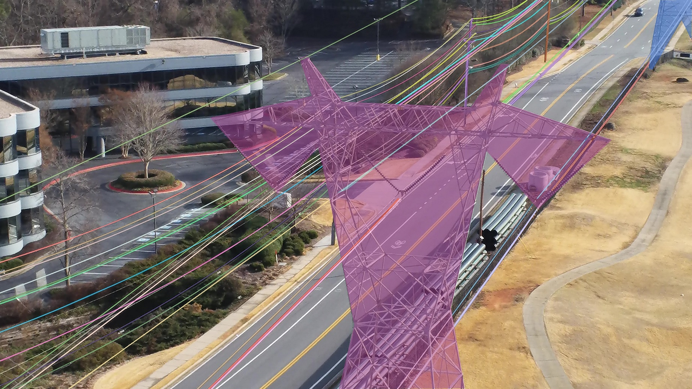
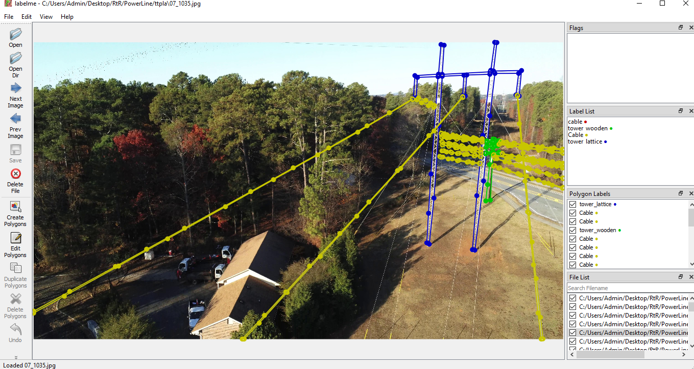
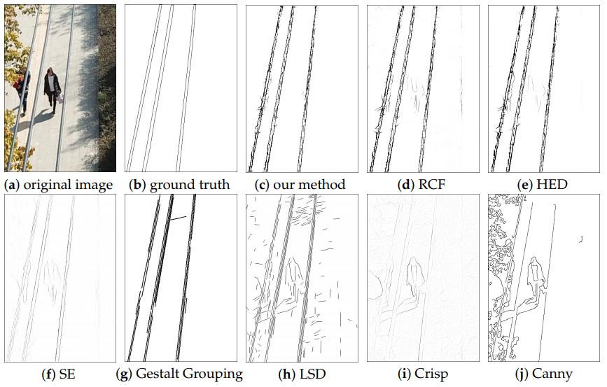
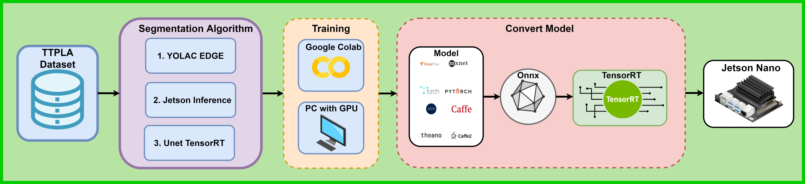

# Overview: GEO tag power line 

## Table of contents
- [Introduction](#introduction)
- [Related Work](#related-work)
- [Dataset](#dataset)
- [RtR Methodology](#rtr-methodology)
- [Intergrated to VIAN system](#intergrated-to-VIAN-system)
- [Jetson Optimization](#jetson-optimization)
- [Appendix](#appendix)
## Introduction
`GEO tag power line` is a power line detection project for `RtR`'s UAVs. To solve the power line detection problem, RtR research team proposes to use `Segmentation` algorithms. The results of the `Segmentation` algorithm are shown below.

<div align='center'>
  
</div>

The system should meet the following standards:
* Accurately detect and segment power lines in images with `mAP` approx `46`.
* Real-time algorithm processing speed with `30 FPS`.
* The algorithm is capable of running on `Jetson Nano`.

<div align='center'>

**Table 1: Evaluation Standars**

|Evaluation standards|Unit|
|-|-|
|mAP|`46`|
|FPS|`30`|

</div>

## Related Work

<div align='center'>

**Table 2: Compare Previous Work**

|Project|Paper|Source|Date|Advantages|Disadvantage|
|-|-|-|-|-|-|
|TTPLA|[paper](https://arxiv.org/pdf/2010.10032.pdf)|[code](https://github.com/r3ab/ttpla_dataset)|2020|TTPLA is a power line dataset that has been labeled in the `COCO` format|Small dataset, only `1200` images|
|YOLACT|[paper](https://arxiv.org/abs/1904.02689)|[code](https://github.com/dbolya/yolact)|2019|A simple, fully convolutional model for real-time instance segmentation|Only run real-time on powerful hardware platforms like the `Nvida Titan Xp GPU`|
|YOLACT++|[paper](https://arxiv.org/abs/1912.06218)|[code](https://github.com/dbolya/yolact)|2019|YOLACT ++ is the improved version of YOLACT with higher speed|It is still not possible to run real-time on embedded devices like `Jetson`|
|YOLACT EDGE|[paper](https://arxiv.org/abs/2012.12259)|[code](https://github.com/haotian-liu/yolact_edge)|2021|YOLACT EDGE is  instance segmentation approach that runs on small edge devices at real-time speeds|The real-time not run on `Jetson Nano` but only running real-time on `Jetson AGX Xavier` with `30.8 FPS`|
|Jetson Inference|None|[code](https://github.com/dusty-nv/jetson-inference/tree/master/python/training)|2019|High speed at `30 FPS` on the `Jetson Nano`|Low accuracy|
|Unet TensorRT|None|[code](https://github.com/vietanhdev/unet-uff-tensorrt)|2020|Acceptable accuracy and high speed with `30 FPS` on the `Jetson Nano`|Accuracy needs improvement|
|CFSC|[paper](https://www.mdpi.com/2072-4292/11/11/1342)|None|2020|Fast speed because of using traditional image processing methods in conjunction with CNN networks|Accuracy is low and does not handle a variety of cases|

</div>

> **Conclusion**: There are three methods that can satisfy the proposed standards: `YOLAC EDGE`,` Jetson Inference` and `Unet TensorRT`. The reason is that these projects are customizable to increase speed and accuracy on the Jetson Nano hardware platform. Possible levels **1**: `YOLAC EDGE`, **2**:` Jetson Inference`, **3**: `Unet TensorRT`.  

## Dataset
### List of dataset

Dataset được đề xuất là TTPLA Dataset. TTPLA Dataset has `1290` photos is extracted from a set of totally of 80 videos. The capacity of the data set is `4.2 Gb`. All aerial videos have a resolution of `3840 × 2160` with `30 FPS`. The lengths of the recorded videos are between `1 min` to `5 min`, which imply `1800` to `9000` images per video, given `30 FPS`. These images are then sampled once every `15 frames` before manual inspection, which means `2 images` per second. List labels of dataset:
* The label `“cable”` is used for all Power Lines in TTPLA.
* The label `“tower”` is used for all Tower Tucohy in TTPLA.
* The label `“void”` is used for any instance (Tower Tucohy or Power Line) which is difficult to recognize into image. For example, a Power Line or even a Tower Tucohy may be labeled by `“void` if it is almost invisible in the image. Any instances labeled by `“void”` are ignored from evaluation.


<div align='center'>

**Table 3: Datasets**
|Dataset|Download|
|-|-|
|TTPLA|[link](https://drive.google.com/uc?export=download&confirm=no_antivirus&id=1AycMYoqSydB73YA0-55sKfRxWF7jMqLU)|
|RTR|[link]()|

</div>

### View dataset
To view and label dataset you need the [labelme](https://pypi.org/project/labelme/) tool.

```
pip install labelme
```

<div align='center'>
  
</div>

## RtR Methodology
### Traditional Method

Use traditional filters to detect lines in an image. [References](https://www.mdpi.com/2072-4292/11/11/1342).

<div align='center'>
  
</div>

### Deep Learning Method

Use the deep learning networks of segmentation to detect power lines in an image. Training TTPLA datasets with three Segmentation algorithms: `YOLACT EDGE`,` Jetson Inference`, `Unet TensorRT`. Then, optimize the trained model with the `.onnx` format in conjunction with` TensorRT` to run at high speed on the `Jetson Nano`. Below is the proposed pipeline.

<div align='center'>
  
</div>

## Intergrated to VIAN system
## Jetson Optimization

- [TkDNN](https://github.com/ceccocats/tkDNN) : is open source that allows compiling models into binary code to optimize model execution speed on `Jetson` family especially` Jetson Nano`.
- [YOLOv4 with TensorRT engine](https://github.com/indra4837/yolov4_trt_ros) : is the open source speed optimization of the Object Detection Yolov4 algorithm on `Jetson`.

<div align='center'>
  
</div>

## Appendix
- [Video Instance Segmentation](https://youtube-vos.org/dataset/vis/): format for training Instance Segmentation algorithms developed by Youtube. 

