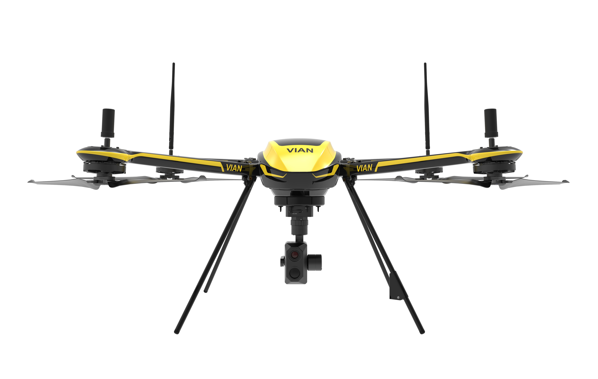
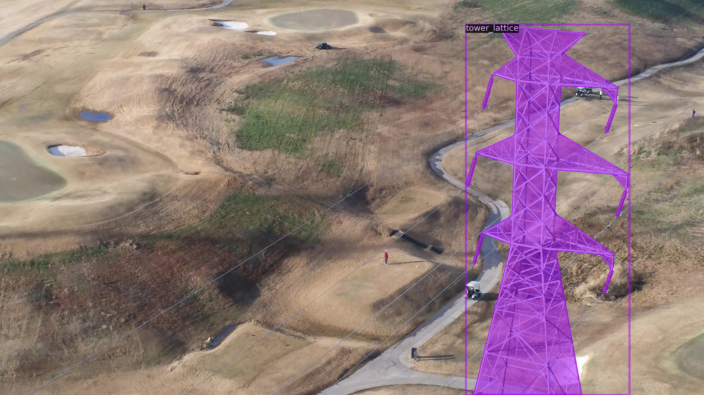

    

    <b>PHƯƠNG ÁN KHẢO SÁT   ĐƯỜNG DÂY ĐIỆN TRUNG THẾ 22KV   SỬ DỤNG MÁY BAY KHÔNG NGƯỜI LÁI VIAN </b>

## I. Nội dung
- [Giới thiệu](#giới-thiệu)
- [Yêu cầu của việc khảo sát đường dây điện](#yêu-cầu-của-việc-khảo-sát-đường-dây-điện-sử-dụng-máy-bay-không-người-lái)
- [Giải pháp của RTR](#giải-pháp-của-rtr)
- [Quy trình khảo sát và nhân sự](#quy-trình-khảo-sát-và-nhân-sự)
- [Kết quả bàn giao](#kết-quả-bàn-giao)
- [Phụ lục](#phụ-lục)

 

----
 

## II. Giới thiệu
`Giải pháp drone trong khảo sát đường dây điện` của công ty TNHH RTR (tiếng Anh: `RTR Drone solution for powerline inspection` - Viết tắt: `RTR Drone Powerline Inspection` - Mã dự án: `RD21-002` là dự án nghiên cứu ứng dụng được triển khai bởi bộ phận R&D của công ty RTR. 
- Mục tiêu của dự án nhằm triển khai một giải pháp phát hiện, phân loại và xác định vị trí các lỗi, hư hỏng, xuống cấp..v.v của đường dây truyền tải điện ở mọi mức độ (hạ thế, trung thế, cao thế).
- Dự án được kì vọng sẽ nâng cao năng suất lao động và độ chính xác so với phương pháp duy tu, bảo trì thủ công hoặc sử dụng flycam cỡ nhỏ trên thị trường.  

Hiện tại dự án đã tới giai đoạn triển khai trên thực địa để thu thập dữ liệu. Máy bay VIAN của RTR được trang bị các thiết bị cần thiết như camera phân giải rất cao (61 - 102 MP) và các mạng neural nhân tạo chuyên dụng để phát hiện các hỏng hóc trong ảnh chụp đã được triển khai hoàn chỉnh.

 

----
 

## III. Yêu cầu của việc khảo sát đường dây điện sử dụng máy bay không người lái

1. Drone phải duy trì khoảng cách an toàn với đường dây (Xem phụ lục A). 
2. Năng suất chụp ảnh để phát hiện lỗi trên đường dây và kiểm tra hành lang an toàn điện phải vượt trội so với phương pháp thủ công hoặc dùng flycam cỡ nhỏ.
3. Độ chính xác của việc phát hiện lỗi tự động sử dụng mạng neural nhân tạo phải đạt độ chính xác tương đương hoặc tốt hơn so với con người. 
4. Thời gian xuất báo cáo (số lượng lỗi, loại lỗi, vị trí lỗi) phải nhanh hơn so với việc khảo sát thủ công.

- Quy trình bay khảo sát đường dây điện cao thế hiện tại:
    - Thời điểm bay: buổi sáng.
    - Sử dụng flycam bay sát trụ khoảng 1-2m (GSD = 0.03 cm/px) để quay video.
    - Các trụ điện có 4 bó dây, mỗi lần bay khảo sát bằng flycam được 1 bó dây.
    - Mỗi trụ cách nhau 200-300m, mất khoảng 7 phút để bay một mặt/ một bó dây. Tổng cộng mất khoảng 60 phút để quay phim các bó dây giữa 2 trụ điện.
    - Video thu thập từ flycam sau đó được xem lại để phát hiện thủ công các sai hỏng (dây cáp bị tưa, đứt, sứ cách điện bị nứt..v.v) hoặc vi phạm hành lang an toàn điện (cây mọc cao hơn độ cao an toàn, chướng ngại vật nằm trong hành lang..v.v).
    - Quy trình khảo sát được thực hiện 1 tháng 1 lần cho tất cả các trụ điện.

- Các nhược điểm tồn tại:
    - Phi công bay khảo sát cần được đào tạo lâu, dẫn đến thiếu nhân sự.
    - Năng suất khảo sát thấp, do thời gian bay lâu và cần xem lại video nhiều lần để xác định vị trí lỗi.

 

----

## IV. Giải pháp của RTR
Hướng giải quyết vấn đề của RTR được chia thành 2 mục như sau:  

---

### Đối với bài toán năng suất :
- Nhằm tăng năng suất khảo sát và khả năng thu thập dữ liệu, RTR đề nghị sử dụng ảnh chụp có độ phân giải cao được đánh dấu GPS thay cho phương án sử dụng video. 
    - Ưu điểm: Nhờ độ phân giải cao của ảnh chụp so với video, mỗi lần chụp sẽ thu được khoảng 50-70m đường dây, nhờ đó máy bay có thể bay ở vận tốc cao mà vẫn đảm bảo ảnh chụp thu được hết toàn bộ đường dây. Hơn nữa có thể geo-tag các ảnh chụp (thêm thông tin GPS) nhờ đó chỉ cần xác định tấm ảnh có lỗi thì có thể xác định được vị trí lỗi trên thực địa.  
    - Nhược điểm: Cần trang bị camera chuyên dụng, khối lượng lớn.
- Tự động hóa quá trình thu thập dữ liệu:
    - Nhờ khả năng bay tự động theo waypoint, drone của RTR có khả năng lập trình để máy bay thực hiện nhiệm vụ khảo sát một cách tự động. Máy bay sẽ bay dọc theo đường dây để chụp ảnh và quan sát hành lang an toàn điện cùng một lúc (máy bay tự nhận diện độ võng của đường dây để hiệu chỉnh camera luôn hướng về giữa đường dây).   Đối với các điểm trụ điện, máy bay tự tăng giảm độ cao và hướng máy ảnh về các vị trí cần chụp trên trụ (đã được chỉ định trong quy trình khảo sát thủ công hiện tại) và tự động thu thập các ảnh này, đưa về cùng một thư mục (tên cột điện). Nhờ đó trụ điện nào có lỗi sẽ được xác định vị trí ngay.  

    

        
    

    
    

        <b> <i> Hình 1. Khả năng nhận diện các trụ điện một cách tự động của mạng neural nhân tạo do RTR phát triển. </i> </b>
    

    - Việc tự động hóa các nhiệm vụ bay khảo sát cũng sẽ giải quyết được bài toán về thiếu hụt nhân sự vận hành máy bay, do với tính năng này, người dùng chỉ việc bấm nút, máy bay sẽ tự xử lý các vấn đề còn lại. Thời gian đào tạo nhân sự để vận hành máy bay sẽ giảm đáng kể.

    **Lưu ý: Quá trình bay tự động chỉ cần setup một lần là có thể sử dụng lại hàng tháng mà không cần chỉnh sửa gì thêm.**
- Tự động hóa quá trình báo cáo lỗi phát hiện được:
    - Đội ngũ R&D của RTR có các chương trình tạo báo cáo tự động sau khi thu thập dữ liệu, người dùng chỉ cần thực hiện nhiệm vụ bay, hình ảnh thu về sẽ được phân loại, phát hiện lỗi và xuất báo cáo tự động theo đúng định dạng khách hàng yêu cầu (excel, .csv...v.v)
---

### Đối với bài toán tự động phát hiện lỗi trên đường dây :
- Việc tự động phát hiện lỗi trên đường dây chủ yếu liên quan đến việc xử lý ảnh và các tác vụ khác trong lĩnh vực thị giác máy tính. Phương án xử lý của RTR là tạo ra một mạng neural nhân tạo chuyên dụng để nhận biết các lỗi trên đường dây và trên trụ điện dựa vào dữ liệu đầu vào là các ảnh có độ phân giải cao. 
- Độ chính xác của mạng neural sẽ được cải thiện sau mỗi lần khảo sát đường dây và hoàn toàn có thể vượt qua khả năng xử lý của người bình thường (xét về năng suất).
- Nhược điểm: cần có bộ cơ sở dữ liệu để đào tạo mạng neural. Bộ cơ sở dữ liệu càng chính xác, khả năng xử lý của mạng neural càng tốt (năng suất hiện tại đạt khoảng 180 hình/phút, độ chính xác 94% so với kỹ thuật viên).

    

        
        
        
    

    
    

        <b> <i> Hình 2. Khả năng nhận diện các lỗi trên trụ điện sử dụng mạng neural nhân tạo do RTR phát triển </i> </b>
    

---

### Một số tính năng :
- Người dùng có thể quan sát quá trình bay thông qua camera FPV trên máy bay.
- Drone có khả năng tự động quay về điểm xuất phát nếu gặp sự cố về pin hoặc mất kết nối với bộ điều khiển (người dùng cũng có thể lựa chọn để máy bay hoàn thành sứ mệnh bay khảo sát rồi mới quay về khi gặp sự cố mất tín hiệu điều khiển).
- Drone có khả năng tránh vật cản vô tình xuất hiện trên tuyến bay (radar).
 
---

## V. Quy trình khảo sát và nhân sự
Quy trình bay khảo sát của RTR sẽ được thiết kế bám sát với quy trình bay hiện tại của một số đơn vị trực thuộc EVN đã có triển khai sử dụng flycam để khảo sát đường dây cao thế. Quy trình sẽ được hiệu chỉnh cho phù hợp với các nhu cầu khác nhau của các đơn vị.  

---
### Các bước thực hiện chính:
- Thu thập dữ liệu về tuyến bay (GPS).
- Thiết kế kịch bản bay (waypoint script).
- Thực nghiệm, hiệu chỉnh kịch bản bay cho phù hợp với thực tế.
- Bay tự động thu thập hình ảnh.
- Xử lý hình ảnh.
- Xuất báo cáo.
---

### Việc triển khai dự án hợp tác có các giai đoạn chính sau:

| Giai đoạn | Công việc | Nhân sự | Đơn vị |
|:-:|:-:|:-:|:-:|
| 1 | Thiết lập tuyến bay tự động | 2 | RTR |
| 2 | Thử nghiệm bay tự động thu thập dữ liệu | 2 | RTR |
| 3 | Kiểm tra báo cáo mẫu tự động xuất, chỉnh sửa cho phù hợp với nhu cầu EVN | 2 | RTR + EVN |
| 4 | Chuyển giao, đào tạo quy trình vận hành máy bay cho nhân sự EVN | 2 | RTR + EVN |
| 5 | Nghiệm thu dự án | N/A | RTR + EVN |
 

----

## VI. Kết quả bàn giao
Kết quả bàn giao sau mỗi nhiệm vụ bay bao gồm:
- Video quá trình setup bay tự động.
- Ảnh chụp phân giải cao (có tọa độ GPS) của các camera (quan sát đường dây và quan sát vi phạm hành lang an toàn điện).
- Ảnh đã qua xử lý và phát hiện lỗi trên đường dây/trụ điện.
- Báo cáo tổng hợp.
- Danh sách lỗi tổng hợp (có vị trí GPS của lỗi hoặc đánh dấu theo số thứ tự trụ điện)  
 
 
**Ngoài ra RTR có thể cung cấp các báo cáo/ dữ liệu khác tùy vào nhu cầu của khách hàng.**

----

# Phụ lục
## **Phụ lục A: Khoảng cách an toàn tối thiểu đối với các đường dây điện**
| Cấp điện áp | Khoảng cách an toàn tối thiểu |
|:-:|:-:|
| Điện hạ thế | 0,3m|
| Điện áp từ 1kV đến 15 kV | 0,7m | 
| Điện áp từ 15kV đến 35 kV | 1,00m |
| Điện áp từ 35kV đến 110 kV | 1,50m |
| Điện áp từ 110kV đến 220 kV | 2,50m |
| Điện áp từ 220kV đến 500 kV | 4,50m |

 (Theo EVN – Tập đoàn Điện lực Việt Nam) 
  
 
 
 

## **Phụ lục B: Thông số kỹ thuật của máy bay VIAN-M** 
| Thông số kỹ thuật | Giá trị | Đặc tính | Ghi chú |
|:-:|:-:|:-:|:-:|
| Thời lượng bay tối đa (tải 1.5kg) | 55 phút |  N/A |  Có thể bay 25 phút khi mang tải 4.5 Kg |
| Trọng lượng cất cánh (cả pin, chưa tải) | 7.5 Kg | N/A | N/A |
| Vật liệu khung thân | Full Carbon | N/A | N/A |
| GPS | Dual | RTK possible | Có thể bay ở chế độ RTK, cho độ chính xác tối đa 1 cm |
| Tầm điều khiển tối đa | 30km | Tự động quay trở về vị trí cất cánh nếu mất tín hiệu điều khiển | Được tích hợp sẵn trong phần mềm điều khiển của máy bay |
 

---
---

