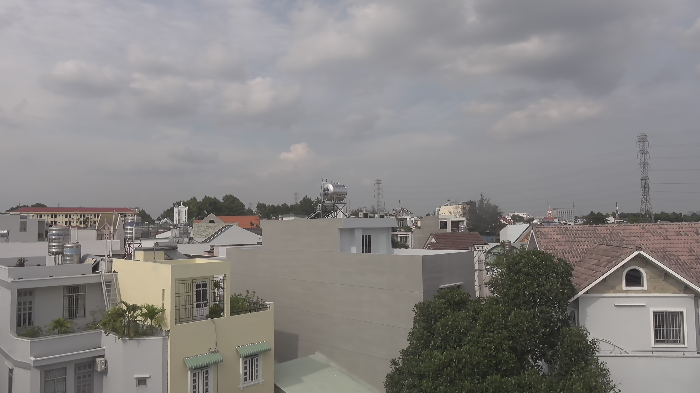
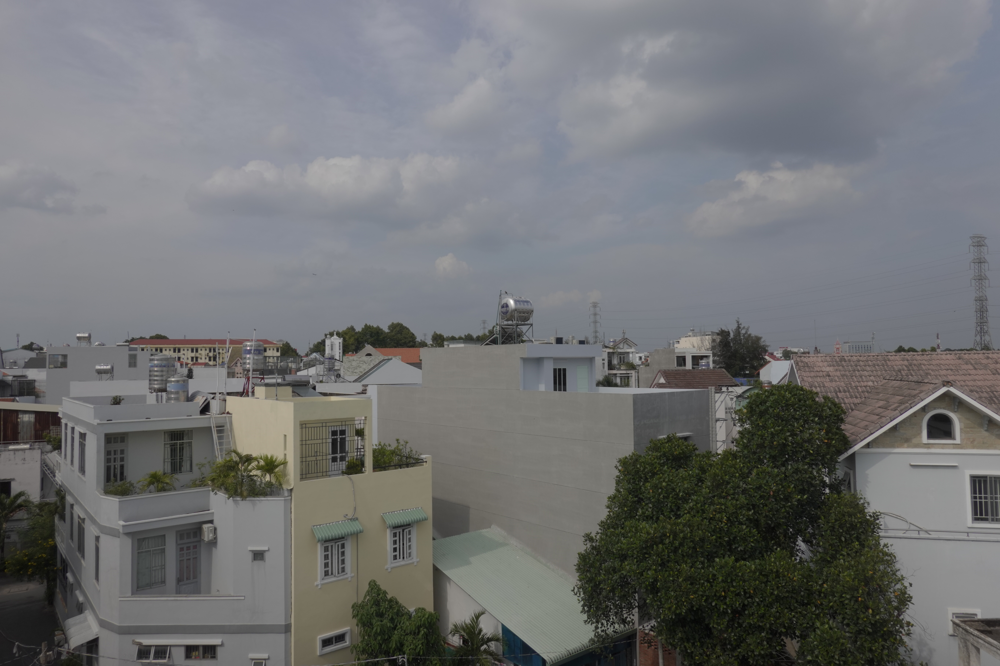
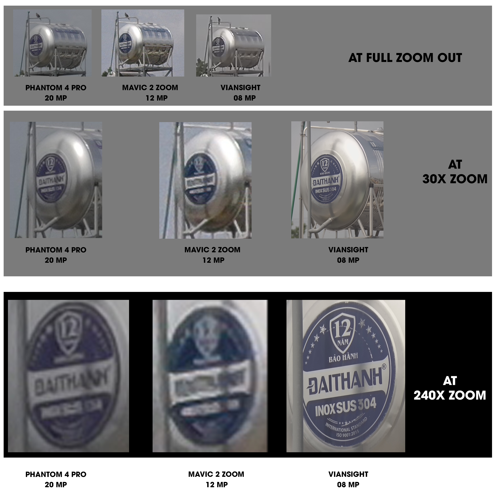

# VIANSIGHT - 8.3MP ( 4.4 mm - 88 mm )
| Distance(m) | GSD at max zoom out (cm/pixel) | GSD at max zoom in  (cm/pixel) | Footstep at max zoom out (m x m) | Footstep at max zoom in (m x m) |
|:-:| :-:| :-:| :-:| :-:|
| 30 | 1.35 | 0.07 |  39.3 x 29.3 | 2 x 1.5 |
| 50 | 2.26 | 0.11 |  65.5 x 48.8 | 3.3 x 2.4 |
| 75 | 3.39 | 0.17 |  98.2 x 73.1 | 4.9 x 3.7 |
| 100 | 4.51 | 0.23 |  130.9 x 97.5 | 6.5 x 4.9 |
| 120 | 5.42 | 0.27 |  157.1 x 117 | 7.9 x 5.9 |
   
# Phantom 4 PRO V2.0 - 20MP ( 8.8 mm )
| Distance(m) | GSD at max zoom out (cm/pixel) | GSD at max zoom in  (cm/pixel) | Footstep at max zoom out (m x m) | Footstep at max zoom in (m x m) |
|:-:| :-:| :-:| :-:| :-:|
| 30 | 0.83 | 0.83 |  45 x 30.3 | 45 x 30.3 |
| 50 | 1.39 | 1.39|  75 x 50.6 | 75 x 50.6 |
| 75 | 2.08 | 2.08  |  112.5 x 75.9 |112.5 x 75.9 |
| 100 | 2.77 | 2.77 |  150 x 101.1 | 150 x 101.1 |
| 120 | 3.33 | 3.33 |  180 x 121.4 | 180 x 121.4 |
   

# COMPARISON PHOTO
Test on 3 camera:  
- VIANSIGHT 8MP 1/2.3" sensor (30x optical zoom).
- Mavic 2 Zoom 12MP 1/2.3" sensor (2x optical zoom)
- Phantom pro 4 20MP 1" sensor (no optical zoom)  

## 
  FULL VIANSIGHT ZOOM OUT  

 

## 
  FULL MAVIC ZOOM OUT  

 

## 
  FULL PHANTOM 4 PRO ZOOM OUT  

  

## 
  COMPARISON AT VARIOUS ZOOM LEVELS 
