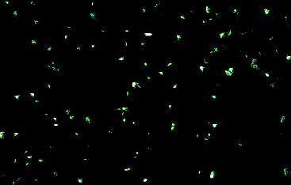
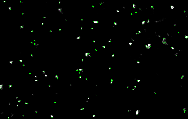
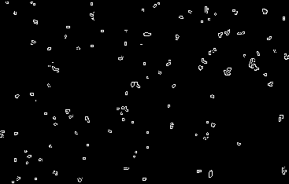
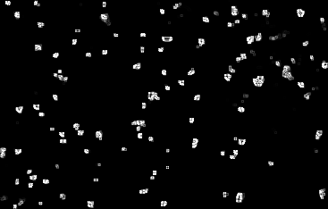

    <b>BÁO CÁO TUẦN 2   Intern: Phạm Phương Thành </b>

## I. Nội dung
- [Tóm tắt](#tóm-tắt)
- [Phương pháp xác định hạt](#phương-pháp-xác-định-hạt)
- [Phương pháp vẽ contour](#giải-pháp-của-rtr)
- [Kết quả](#kết-quả)
- [Remark](#remark)

 

----
 

## II. Tóm tắt
Yêu cầu công việc tuần 2 gồm xác định hạt nước ở hệ thống bơm và xuất file csv chứa thông tin hạt gồm vị trí và bán kính.
Ảnh mẫu được dùng là ảnh test_crop.png được cắt ra từ ảnh origin.png do anh Quân đưa.
Các phương pháp khoanh vùng vị trí hạt đã dùng được lấy từ bộ lọc Canny edge detector, Laplace và Sobel và phương pháp xác định contour trong OpenCV gồm có Contour approximation và convex hull. Qua tham khảo một số bài báo khoa học, bộ lọc phổ biến cho xác định hạt của máy bơm bằng phương pháp xử lý hình ảnh là Canny và Sobel. [[1]](#1), [[2]](#2), [[3]](#3) 
Trong đó bộ lọc Canny cho kết quả chính xác nhất lần này. 
Hình ảnh trong report được tạo từ file test_crop.png. Giải thuật được thực hiện trên các ảnh sau đã nộp cho anh Quân và Khôi.

 

----
 

## III. Phương pháp xác định hạt

1. Contour approximation

Contour approximation sử dụng thuật toán  Douglas-Pecker tạo một đường cong đơn giản hóa đồng dạng một đường cong cho trước được tạo bởi các đoạn thẳng. Thuật toán định nghĩa không đồng dạng dựa trên khoảng cách tối đa giữa đường cong gốc và đường cong đơn giản hóa. Đường cong đơn giản hóa chứa tập con gồm các điểm thuộc đường cong gốc [[4]](#4)

        

    

        <b> <i> Hình 1. Kết quả của contour approximation </i> </b>

2. Convex hull

Convex hull là hàm kiểm tra convexity defects và sửa nó. Nếu hàm gập vào trong thì sẽ bị coi là defect.[[4]](#4) 
Lúc dùng hàm này em nghĩ nếu đối tượng là hạt nước ta coi là hình cầu thì có thể kiểm tra tính lồi-lõm qua đây để tạo contour.

        

    

        <b> <i> Hình 2. Kết quả của convex hull </i> </b>

 
 3. Canny edge detection 

Là thuật toán edge detection nhiều bước nổi tiếng được phát triển bởi John F. Canny.
        - Noise reduction bằng 5x5 Gaussian filter
        -Tìm Intensity gradient bằng Sobel kernel
        -Non-maximum suppresion: sau khi có độ lớn và chiều gradient thực hiện full scan ảnh để loại bỏ các phần tử không thuộc edge. mỗi pixel được check nếu nó là local maximum ở trong vùng lân cận theo chiều gradient.[[5]](#5)

        

    

        <b> <i> Hình 3. Kết quả của canny edge detection </i> </b>

 

 4. Sobel derivatives

Sobel operator tính xấp xỉ gradient của hàm intensity của ảnh bằng cách kết hợp Gaussian smoothing và differentiation.[[6]](#6)

        

    

        <b> <i> Hình 4. Kết quả của Sobel derivatives </i> </b>

 

 
 5. Laplace operator

Sử dụng Laplace operator để xác định nếu là edge thì operator bằng 0.[[7]](#7)

        

    

        <b> <i> Hình 4. Kết quả của Laplace operator </i> </b>

 

 

----
 

## III. Phương pháp vẽ contour

Việc chọn phương pháp vẽ contour dựa trên hình dạng hạt ở trong ảnh. Ở những ảnh mới khởi động hạt có dạng tia, sau đó về chuyển về dạng hạt. Do đó các phương pháp sau đã được sử dụng

1. Minimum bounding circle 
2. Minimum bounding box
3. Bounding rotated rectangle

 

----
 

## IV. Kết quả 

Từ kết quả từ file test_crop.png, kết quả của bộ lọc Canny là phù hợp nhất vì xác định được nhiều và chính xác nhất số lượng contouor. Sau đó bộ lọc được triển khai trên các file ảnh mới, trích xuất thông tin về contour ra file csv. 

 

----
 

## V. Remark 

- Cần học hết khóa Machine Vision trên MIT OCW, dự kiến 2 ngày cuối tuần này là xong
- Cần viết code gọn hơn: học clean code
- Mất nhiều thời gian đọc documentation về function: argument là gì, return nếu được trữ hết vào 1 biến thì sẽ có dạng gì
- Cần có một cái gì đó để hệ thống các cập nhật sau

[1] Wei Wei, Shuxiang Guo, Fang Wu, Yuehui Ji, & Yunliang Wang. (2013). Image processing-based measurement of volume for droplets in the microfluidic system. 2013 ICME International Conference On Complex Medical Engineering. doi: 10.1109/iccme.2013.6548304
[2] Biolè, D., Wang, M., & Bertola, V. (2016). Assessment of direct image processing methods to measure the apparent contact angle of liquid drops. Experimental Thermal And Fluid Science, 76, 296-305. doi: 10.1016/j.expthermflusci.2016.04.006
[3] Minov, S., Cointault, F., Vangeyte, J., Pieters, J., & Nuyttens, D. (2016). Spray Droplet Characterization from a Single Nozzle by High Speed Image Analysis Using an In-Focus Droplet Criterion. Sensors, 16(2), 218. doi: 10.3390/s16020218
[4] OpenCV: Contour Features. (2021). Retrieved 4 June 2021, from https://docs.opencv.org/master/dd/d49/tutorial_py_contour_features.html
[5] OpenCV: Canny Edge Detection. (2021). Retrieved 4 June 2021, from https://docs.opencv.org/master/da/d22/tutorial_py_canny.html
[6] OpenCV: Sobel Derivatives. (2021). Retrieved 4 June 2021, from https://docs.opencv.org/3.4/d2/d2c/tutorial_sobel_derivatives.html
[7]  OpenCV: Laplace Operator. (2021). Retrieved 4 June 2021, from https://docs.opencv.org/3.4/d5/db5/tutorial_laplace_operator.html